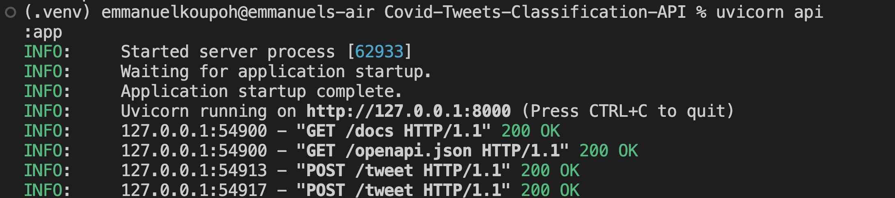
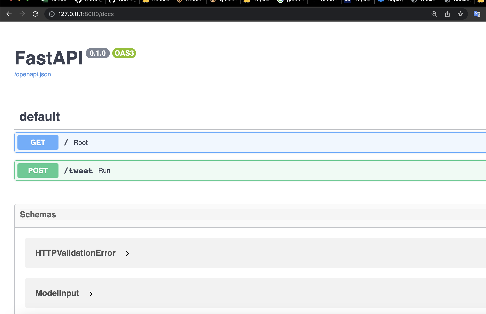
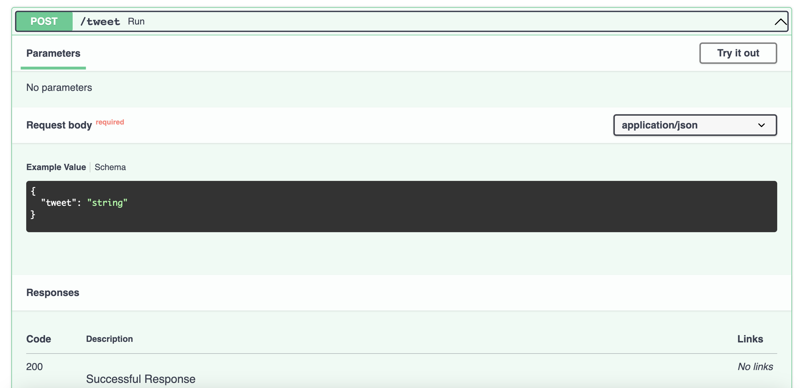
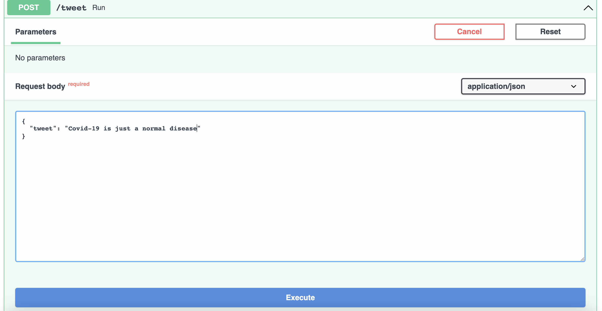
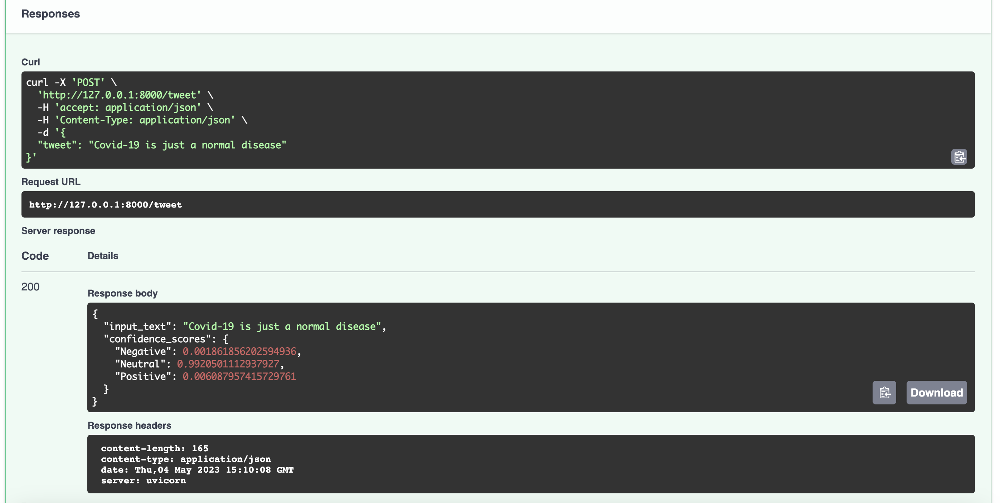

# Covid-Tweets-Classification-API
This Sentiment Analysis API is a tweets classifer system based on the [Hugginface pretrained model (DistillBERT)](https://huggingface.co/docs/transformers/model_doc/distilbert), [finetuned](https://huggingface.co/GhylB/Sentiment_Analysis_DistilBERT) by one of my brilliant trainees [Mr. Gilbert Botchway](https://www.linkedin.com/in/gilbert-botchway/) on the [Zindi Covid-19 tweets classification dataset](https://zindi.africa/competitions/covid-19-tweet-classification)

## Setup
Please follow the instructions below to run the app.
`commands will be added soon`

## Execution
Please follow the instructions below to run the app.
`commands will be added soon`

## Illustrations

API execution :

API docs :

API testing :

